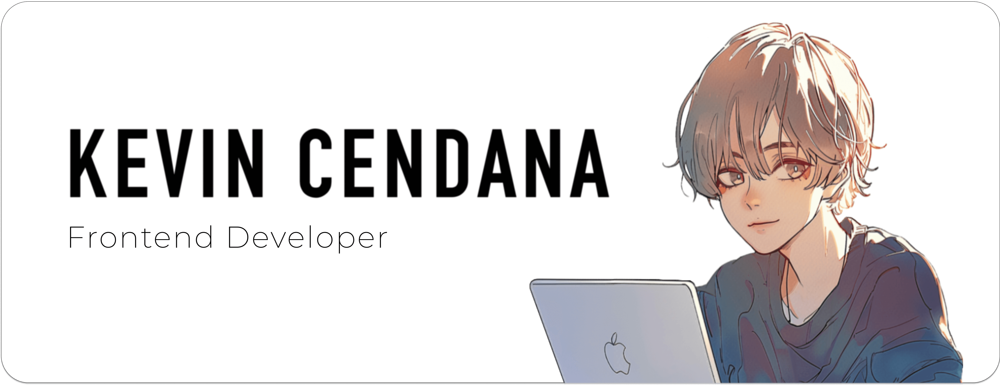
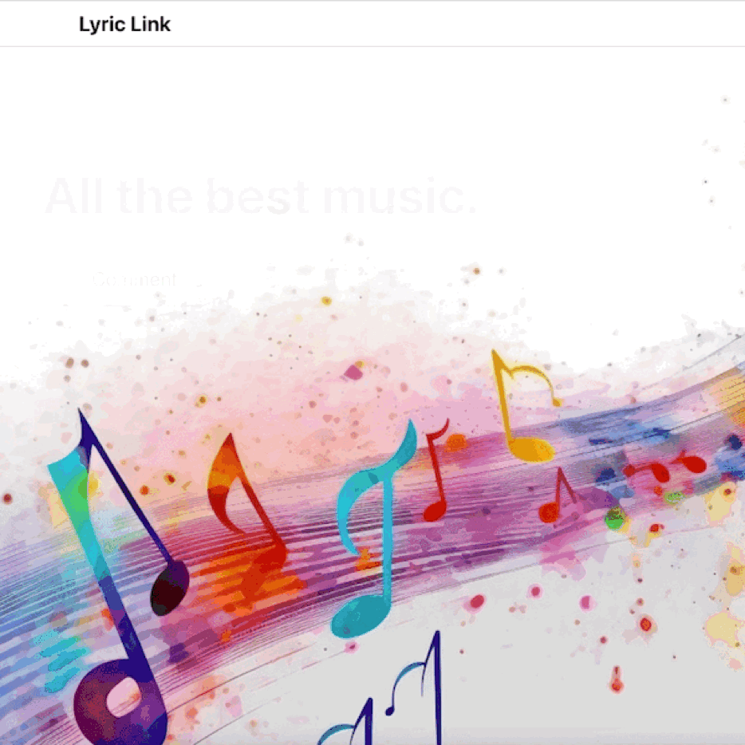

<!-- Header Image -->

<!-- Introduction Text -->

Hello! I’m Kevin, a passionate Frontend Developer who loves developing and designing applications. 
 
Thank you for giving my profile a visit! 

<!-- Section: Projects -->

  
<h3>&nbsp; Projects</h3>

|  | **[Portfolio Website](https://kevinpcendana.com/)** My personal portfolio website that showcases my projects, skills, and experiences.    I designed a template of the app with Figma and developed it from scratch with React. |
|:--:|:--|

|  | **[Chunkify](https://github.com/Kevin-Cendana/Chunkify)** Chunkify is a task list with a twist: AI breaks down your tasks into smaller chunks. Chunkify is perfect for those who get overwhelmed easily, such as those with ADHD.   Made for the [AI Hackathon @ CSUS](https://lu.ma/o2sau79c) in April 2024 with a team of 4, but development is still ongoing. I made the UI & most of the frontend code. |
|:--:|:--|

|  | **[AT&T 5G Technology Website](https://github.com/Kevin-Cendana/Hackathon-ATT-EmpowHer)** A website that showcases the benefits of AT&T's 5G technology, such as faster speeds, lower latency, and more.   Made for [AT&T's Hackathon: EmpowHer](https://life.att.jobs/college-students-empowher-hackathon/) in June 2023. I designed and developed the website from scratch with HTML, JS, and CSS on my own. |
|:--:|:--|

|  | **[Lyric Link](https://github.com/Kevin-Cendana/Hackathon-SacHacks-2023)** A demo application using Django, React, HTML & CSS, Lyric Link acts as a forum that sorts through Top 100 songs on Billboard.   Made for [SacHacks](https://sachacks-v.devpost.com/) in November 2023 in a team of 4 over the weekend. I designed all of the UI, created all of the frontend code, and successfully linked with my teammates' Python backend code. |
|:--:|:--|

|  | **[Maplestory Mini](https://github.com/Kevin-Cendana/Byte-Sized-Projects/tree/main/Maplestory%20App)** A project based on the gameplay loop of one of my favorite childhood games, Maplestory.   I made the app for fun to try out mobile development and familiarize myself with Flutter & Dart. |
|:--:|:--|

| **[Byte Sized Projects](https://github.com/Kevin-Cendana/Byte-Sized-Projects)** I am a firm believer that the best way to learn is by doing. As such, I like to make a lot of smaller apps in my free time just to get some practice or to try out a new field of programming for fun!   As an example, here are a series of apps I made using Swift UI, including a sleep tracker, time converter, tip calculator, Word Scrabble, Guess the Flag, & more. I made these apps to practice Swift UI and iOS development. 
|:--|
|      |

<!-- Section: Academia --> 

  
<h3>&nbsp; Academia</h3>

  
I graduate from California State University, Sacramento as a Computer Science major in May 2024! All of my relevant coursework can be found in <a href="https://github.com/Kevin-Cendana/Computer-Science-Coursework">this</a> repository.

<!-- Section: Volunteering --> 

  
<h3>&nbsp; Volunteering</h3>

  <h3><a href="https://csus.acm.org/">Association for Computing Machinery (ACM)</a></h3>
  ACM is the premiere Computer Science & Computer Engineering-based club on the CSU Sacramento campus. As their webmaster, I've helped maintain, design, and develop the website for the club, such as by adding in the members section to the website.
  <h3><a href="https://github.com/Kevin-Cendana/Video-Game-Design-Club-CSUS">Video Game Design Club (VGDC)</a></h3>
  I'm a programmer for the VGDC at CSUS, which is filled with passionate students learning to design and create video games. I've helped develop a game demo for a game jam session, and I'm also the sole designer & developer of the club's website.

