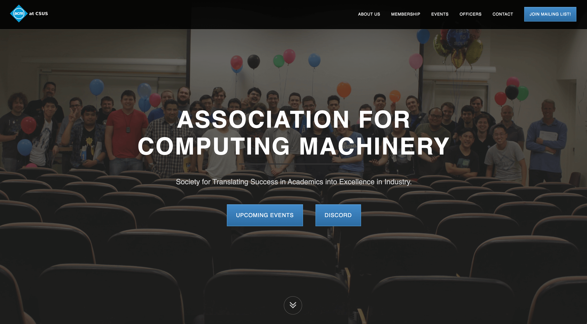

<!-- Header Image -->

<!-- Introduction Text -->
Hello! I’m Kevin, a passionate Frontend Developer who loves developing and designing applications.  
Thank you for giving my profile a visit!

<!-- Section: About Me -->
## ✍️ About Me
Whether it's for my career or my hobby, I love programming. I've always been drawn to the puzzle solving aspect and the challenges that come with it, as well as the satisfaction of seeing my creations come to life from designs.

<!-- Section: Career -->
## 💼 Career
  
I currently work as a Frontend Developer at [DreamArcades!](https://www.dreamarcades.com/) It's a fun job that involves developing, maintaining, and designing the website for the company, with the occasional backend task.

<!-- Section: Projects -->
## 🚀 Projects

<!-- Project: Portfolio Website -->
### [Portfolio Website](https://kevinpcendana.com/)
My personal portfolio website that showcases my projects, skills, and experiences.  
Designed with Figma and developed from scratch with React.  

<!-- Project: Chunkify -->
### [Chunkify](https://github.com/Kevin-Cendana/Chunkify)  
[In Development]  
Chunkify is a task list app with a twist: AI helps give advice and break down your tasks into smaller chunks! Chunkify is targeted towards people who get overwhelmed easily, such as people with ADHD, anxiety, or adjacent disorders. With this in mind, I have designed Chunkify's UI to be as clean, simple, and quick to use as possible.  
Made for the [AI Hackathon @ CSUS](https://lu.ma/o2sau79c) in April 2024 with a team of 4, but development is still ongoing. I made the UI as well as most of the frontend code.  
<!-- Placeholder for future image -->

<!-- Project: AT&T 5G Technology Website -->
### [AT&T 5G Technology Website](https://github.com/Kevin-Cendana/Hackathon-ATT-EmpowHer)
  
A website that showcases the benefits of AT&T's 5G technology, such as faster speeds, lower latency, and more.  
Made for AT&T's Hackathon: EmpowHer in June 2023. I designed and developed the website from scratch with HTML, JS, and CSS on my own.

<!-- Project: Lyric Link -->
### [Lyric Link](https://github.com/Kevin-Cendana/Hackathon-SacHacks-2023)
  
A full stack demo application using Django, React, HTML & CSS, Lyric Link acts as a forum that sorts through the top 100 songs on Billboard. Users can leave thoughts and comments on the songs.  
Made for [SacHacks](https://sachacks-v.devpost.com/) in November 2023 in a team of 4 over the weekend. I designed the UI, created all of the frontend code, and successfully linked with my teammates' backend code.

<!-- Project: Maplestory Mini -->
### [Maplestory Mini](https://github.com/Kevin-Cendana/Byte-Sized-Projects/tree/main/Maplestory%20App)
  
A project made to practice Flutter & Dart based on the gameplay loop of one of my favorite childhood games, Maplestory. I made the app for fun to try out mobile development!

<!-- Project: Byte Sized Projects -->
### Byte Sized Projects
I am a firm believer that the best way to learn is by doing. I like to make a lot of smaller apps in my free time just to get some practice or to try out a new field of programming for fun! For example, here are a series of apps I made using Swift UI, including a sleep tracker, time converter, tip calculator, Word Scrabble, Guess the Flag. I made these apps to practice Swift UI and iOS development.  
  
  
  
  

<!-- Section: Academia -->
## 📚 Academia
I graduate from California State University, Sacramento as a Computer Science major in May 2024! All of my relevant coursework can be found in [this](https://github.com/Kevin-Cendana/Computer-Science-Coursework) repository.

<!-- Section: Volunteering -->
## 🤝 Volunteering

<!-- Volunteer: ACM -->
### [Association for Computing Machinery (ACM)](https://csus.acm.org/)
I'm the current webmaster for the ACM club at CSUS, the premiere Computer Science & Computer Engineering-based club on the CSU Sacramento campus. I help maintain, design, and develop the website for the club.

<!-- Volunteer: VGDC -->
### [Video Game Design Club (VGDC)](https://github.com/Kevin-Cendana/Video-Game-Design-Club-CSUS)
I'm a programmer for the VGDC at CSUS, which is filled with passionate students learning to design and create video games. I've helped develop a game demo for a game jam session, and I'm also the sole designer & developer of the club's website.
